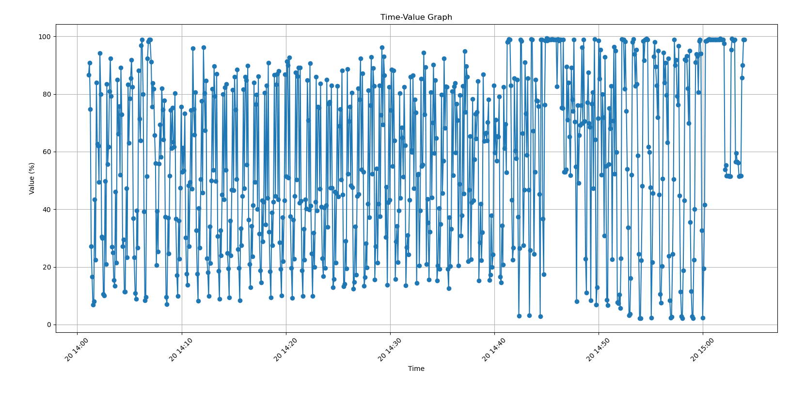
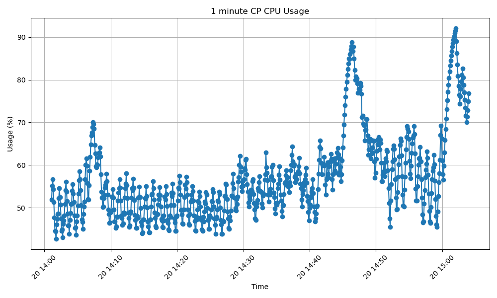
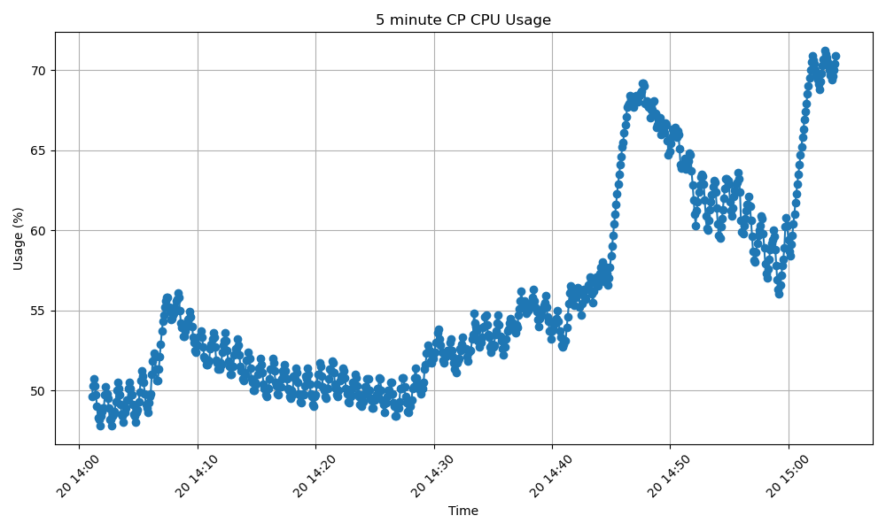

For troubleshooting Current control plane on ASA/FTD, it would be useful to see a graph of CP CPU. However since FMC does not show this graph as of writting of this article, we can use EEM to gather this data and plot the graph.

 
For the Input we used the following EEM script to gather CP CPU usage and show clock after 5 seconds intervals and write to file disk0:/CP_CPU.

 

event manager applet cpucheck
event timer watchdog time 5
action 1 cli command "sh cpu detailed"
action 2 cli command "show clock"
output file append disk0:/CP_CPU

 

Then the attached script was use to get a time value plot of the 5 seconds, 1 minute, 5 minute CP CPU usage
 

It outpts three graph and average of CP CPU usage.

 

RAJATSH-M-V7QW:LIST_PYTHON rajatsh$ python3 23.py 
Enter the file path: CP_CPU.txt

Average of 5 seconds CP CPU Usage:
57.3

Average of 1 minute CP CPU Usage:
57.0

Average of 5 minute CP CPU Usage:
55.6

Script and data on which script operated are attached. User may choose to use exact EEM script and Python code to analyse. 

 

Please note, EEM in example is running after 5 seconds, and script is plotting "5 seconds", "1 minute" and "5 minute" usage graphs. If your requirements are different, you will need to edit the EEM timeinterval. Python script will work with any time interval, but accurate data would be for e.g if you need to look at 5 seconds usage, run the EEM with 5 seconds interval and "5 seconds graph" is the data to analyze,  if you need to look at 1 min usage, run the EEM with 1 min. interval and "1 min graph" is the data to analyze and so on for 5 minutes,  What will be not so useful would to run the script after 15 minutes interval and look at 5 seconds graph. 

